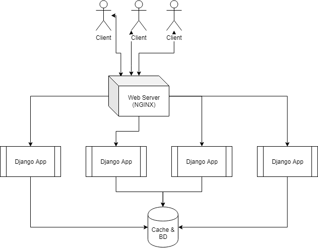

# Zelda - Educational Information Management


> This is a technical report describing the infrastructure behind the project.
>
> First Draft: Ruben Branco, 07/03/2019
> 
> Modified: Ruben Branco, 14/03/2019

## Introduction

This technical report will follow a top down approach, covering three main topics:

1. Top level interactions between client - server - services.
2. A look into the UI components.
3. Back-end services.

The goal of the report is to consolidate general interactions between the various parts of the system but also at the level of the project file organization.

A secondary goal is to be able to share the report and give forth a general idea of how the system should behave and look like, hopefully making it easier to receive feedback.

## 1. General Infrastructure

There are three entrypoints to the system, each very standard in any web application but nevertheless with their own purpose in the system.

<dl>
  <dt>GET Requests to https://[dev.]zelda-edu.me/*</dt>
  <dd>GET Requests will provide the general template with the application javascript, along with context dependant (through session or url args) data.</dd>
  <dt>POST Requests to https://[dev.]zelda-edu.me/*</dt>
  <dd>Occasional need to avoid REST api and do a direct POST to the server, such as for authentication purposes, for example.</dd>
  <dt>POST/GET Requests to https://[dev.]zelda-edu.me/api/*</dt>
  <dd>REST API to update UI component states as the user browses through the application, bringing a seamless experience.</dd>
</dl>

At the time of this report, the domain used by the system is zelda-edu.me, with a single subdomain under dev.zelda-edu.me for unstable build testing.

From a top-down view of the system, the topology looks like the following:



From the topology one can assume there are two saturation points, the web server and the cache/database, again, as most information systems.
The django app, which is where the business and ORM logic all are, can be easily replicated using Docker, as it is a simple stateless application.

The web server load can be eased off by having multiple servers and have round robin distribution at a DNS level, however, the BD replication requires synchronization between replicas and the master, which is not as straight forward.

This is a rich mans problem, as it would require a lot of users to saturate a database system, and in the context of an educational exercise one would never achieve such loads, however for the sake of learning and scalability, Kubernetes should be considered as a possible tool to add to the stack to allow for stateful app replication for the database.

**Not represented in the diagram** are the supporting microservices. The django app should delegate much of the heavy work to microservices, as to avoid the creation of a big monolithic application, not suited for the complexity of the domain of the application (Education information tends to be highly multidimensional, so extensions to the system are likely).

## 2. User Interface

The idea for the UI is for it to be as fast, coherent and seamless as possible. Since the framework chosen was ReactJS, the goal is to build it as a MPA(Multi-Page Application), however minimizing the refresh times.

Let's look inside the inner workings of one of the ways to construct an MPA using ReactJS, which is what we will follow, through the directory structure for the UI Javascript (or JSX in this case).

```
src
├───Components
├───Pages
```

Components is where the javascript code for the parts that compose a page/view are stored, each component has a state and can be reused in other pages.
Components will be classes that extend React.Component. Components can use other components, for example, a navbar, which has a state because the links in the navbar change according to the view you are on and even to the type of user that you are. That navbar is also composed of other components, such as buttons, which also have a state because they can encode different functions/redirect to different views!

Pages are essentially views on the client side, which themselves are also components. Pages are composed of many components, defining a global state for the page, which is why they are conceptually different than the components that compose the page.

If the user accesses the website from a context (for example, by going directly to the url zelda-edu.me/grades/pti-ptr), it is unnecessary to request information for the grades through the REST API as the props will be injected server side, reducing time to interactive on the client.

## 3. Back-End

As mentioned previously, there will be an effort to parallelize as much as possible the applications on the back-end, creating as much redundancy as possible for failures and user spikes.

The replication amount can be dynamically changed, as docker/kubernetes allow upsizing or downsizing on the fly, never actually going offline while the system adjusts.

The back-end will have 5 components.

1. Web Server (NGINX).
2. Django App
3. Cache
4. Database
5. Message Queue System

The part that is worth to take a closer look is the django app. Using the standard django library, we define the views for the system, define static files, create the database ORM, which automatically translates to SQL. The views for the system are mostly straight-forward, without much tweaking, as most of the real work is done through the REST API and the UI.

The REST API will essentially make CRUD actions upon the database, along with necessary filtering throughout the users browse.

As mentioned in section 2, if the user connects directly with a context, such as accessing through a link that already filters a lot of information, the template has data from the database injected as context. This can lead to code duplication, as the TemplateView will be doing operations on the database that the REST API would implement as well.

Thus, I recommend that the classes that implement the TemplateView and the ViewSet(which are the building blocks of rest application on django-rest-framework) be wrappers for functions, like so (**This is just an example**):

```python3
    def get_user_age(user_id):
        return User.objects.get(id=user_id).age

    class UserAgeView(TemplateView):
        def get(self, request, user_id):
            return render(
                request,
                self.template_name,
                context=dict(
                    user_age=get_user_age(user_id),
            ))

    class UserAgeViewSet(ViewSet):
        def get_queryset(self):
            return get_user_age(self.request.query_params.get("user_id"))
```

This way we can avoid duplicating code by writing the same code routines in two different places.

### Small Note

This report will be updated as the project is ongoing with new insights.
